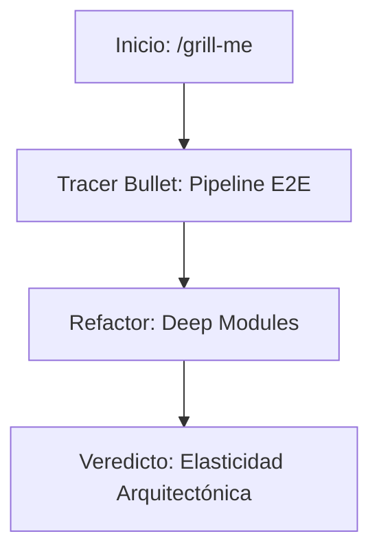

# 🎙️ Voice Agent: Software Journey

Bienvenido a la bitácora de ingeniería del **Voice Agent**. Este sitio documenta el proceso de diseño, los desafíos arquitectónicos y las decisiones tomadas bajo la lente de **"A Philosophy of Software Design"** de John Ousterhout.

Nuestra meta no fue solo construir un agente de voz, sino crear una pieza de software con **bajo costo cognitivo** y **módulos profundos**.

---

## 🗺️ Mapa del Viaje

### [Sección 1: La Bala Trazadora (Tracer Bullet)](seccion-1-tracer-bullet.md)
*Cómo pasamos de la incertidumbre a una arquitectura validada.*
- El rol de la skill `/grill-me` y el PRD.
- Definición del Tracer Bullet: Integración E2E asíncrona.
- Feedback temprano y reducción de riesgos.

### [Sección 2: Anatomía de la Complejidad](seccion-2-anatomia-complejidad.md)
*Análisis técnico de la estructura del código.*
- **Deep Modules**: El poder de `PipelineState` y `VoicePipeline`.
- **Shallow Modules**: Combatiendo la fragmentación innecesaria.
- **Information Leakage**: Cómo el ocultamiento de información salvó nuestra escalabilidad.

### [Sección 3: Veredicto Retrospectivo](seccion-3-veredicto-subagentes.md)
*Evaluación de los sub-agentes y el diseño final.*
- Debate de las 3 propuestas arquitectónicas.
- Resistencia al **Change Amplification**.
- Conclusiones sobre el "buen gusto" en el código.

---
> *"The most important thing in computer science is naming, but the second is keeping complexity under control."* — Inspirado en Ousterhout.
