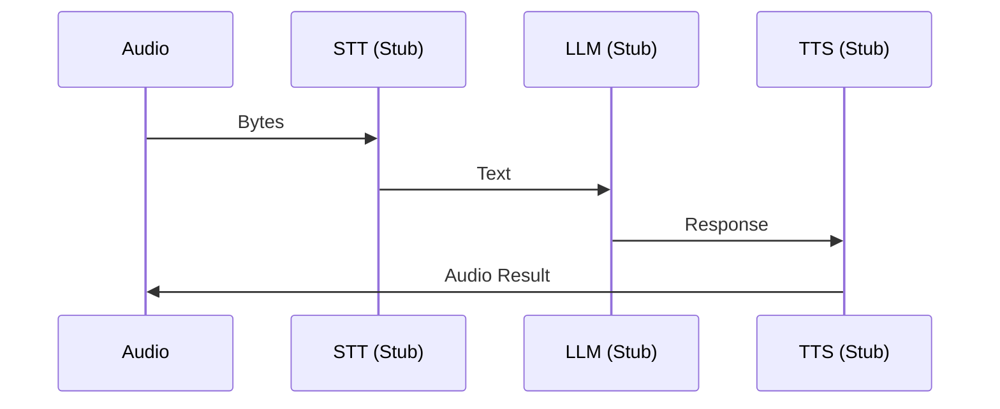

# Sección 1: La Bala Trazadora (Tracer Bullet)

En el desarrollo de software, la **complejidad** a menudo surge de intentar construir el "edificio completo" sin haber probado primero que el suelo puede sostener el peso. Para este proyecto, aplicamos el concepto de **Tracer Bullet** (Bala Trazadora): una implementación delgada pero completa que atraviesa todas las capas del sistema.

## 🎯 Refinando el Objetivo con `/grill-me`

Antes de escribir una sola línea de código, utilizamos la skill `/grill-me`. Esta fase de interrogación fue crucial para evitar la **parálisis por análisis** y el **scope creep**.

- **Asunción Inicial:** Queríamos una aplicación de producción lista para la nube.
- **Realidad tras el Grill:** Descubrimos que el valor real era **educativo**. El usuario necesitaba entender el *pipeline* asíncrono, no un sistema de login complejo.
- **Resultado:** Un PRD (Product Requirements Document) enfocado en la observabilidad y el uso de `asyncio` puro, eliminando abstracciones de terceros que ocultan la complejidad.

## 🚀 El Tracer Bullet: Issue #1 Pipeline E2E

Elegimos la **Issue #1: Tracer Bullet Pipeline** como nuestro primer objetivo. ¿Por qué? Porque era el punto de mayor riesgo de integración. 



Unir **Audio → STT → LLM → TTS** de forma asíncrona es propenso a errores de concurrencia y fugas de estado. No podíamos permitirnos construir un módulo de STT perfecto si no sabíamos cómo iba a "hablar" con el LLM.

### El código de la "Bala":
Implementamos un `VoicePipeline` que utilizaba *stubs* (clases falsas) para las etapas pesadas, pero que validaba la comunicación mediante `asyncio.Queue`.

```python
# Un fragmento del Tracer Bullet original en src/core/pipeline.py
class VoicePipeline:
    async def run(self, audio_bytes: bytes) -> bytes:
        # Iniciamos workers de forma efímera
        stt_task = asyncio.create_task(self._stt_worker())
        llm_task = asyncio.create_task(self._llm_worker())
        tts_task = asyncio.create_task(self._tts_worker())

        await self._stt_queue.put(audio_bytes)
        response_audio = await self._out_queue.get()
        return response_audio
```

## 📈 Feedback Temprano

Gracias a este enfoque, detectamos en la primera semana que el estado del pipeline no podía ser una simple variable global. Necesitábamos un objeto que centralizara el estado para que el futuro panel web pudiera "observar" el movimiento de los datos sin acoplarse a los workers.

Este hallazgo temprano nos llevó directamente a la creación de `src/core/state.py`, nuestro primer paso hacia un **Módulo Profundo**.
